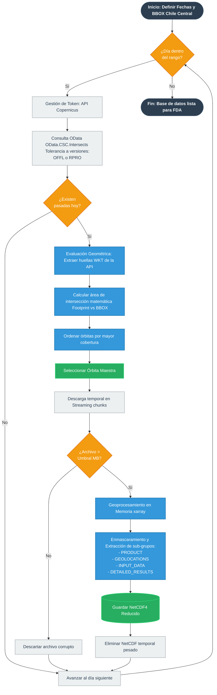

# Descarga de datos satelitales Sentinel-5p
Proceso optimizado de descarga de datos satelitales, enfocado en la columna troposférica de NO2 de Sentinel-5p de Coernicus (ESA). Este trabajo ha sido posible gracias al proyecto FONDECYT N°1241477.

Este pipeline automatizado se puede explicar en 4 fases lógicas:

## Fase 1: Autenticación Dinámica (get_token)
- La API de Copernicus expira los tokens de acceso cada 10 minutos (600 segundos), provocando caídas en descargas masivas.
- El script almacena el token de forma global y calcula su tiempo de expiración. Antes de cada solicitud, verifica si el token actual tiene al menos 2 minutos de vida restante. Si es así, lo reutiliza; de lo contrario, solicita uno nuevo. Esto garantiza ejecuciones ininterrumpidas durante días.

## Fase 2: Consulta API y Tolerancia a Versiones (buscar_productos_dia)
- Se utiliza la API OData de Copernicus mediante un filtro geográfico (OData.CSC.Intersects) y temporal estricto (00:00 a 23:59 UTC).
- Incorpora la condición (contains(Name,'OFFL') or contains(Name,'RPRO')). Esto hace que, si la Agencia Espacial Europea (ESA) aún no ha reprocesado los datos de un año reciente (2023-2024), descargará la versión Offline (OFFL). Si es un año antiguo (2018-2021), descargará la Reprocessed (RPRO).

## Fase 3: Inteligencia Espacial y Selección de Órbita Maestra (__main__)
- Se aíslan las pasadas del satélite correspondientes a las horas de sobrepaso en Chile (bloques T17, T18, T19).
- TROPOMI suele superponer dos órbitas marginales sobre Chile en un mismo día. Para evitar promediar bordes de órbitas deformados, el script lee el Footprint (huella en WKT) del archivo directamente desde los metadatos de la API, lo convierte a un polígono con la librería shapely y calcula su área de intersección real con la caja de estudio (BBOX). 
- Ordena los candidatos de mayor a menor cobertura. Descarga la órbita con más superposición y, una vez recortada con éxito, ejecuta un break para ignorar las órbitas marginales del mismo día, ahorrando ancho de banda, tiempo y almacenamiento.

## Fase 4: Descarga Temporal y Recorte Estructural (procesar_orbita y recortar_nc)
- Baja el archivo crudo (~500 MB) en fragmentos (chunk_size=8192) a un archivo temporal.
- Encuentra los índices exactos del BBOX. Luego, en lugar de arruinar el archivo NetCDF original, abre meticulosamente los 4 grupos exigidos por el modelo CHIMERE (PRODUCT, GEOLOCATIONS, INPUT_DATA, DETAILED_RESULTS), los recorta espacialmente y los reensambla en un nuevo NetCDF de apenas unos pocos Megabytes (mode='a').
- Finalmente, borra el archivo crudo original.

## Diagrama del proceso de descarga

